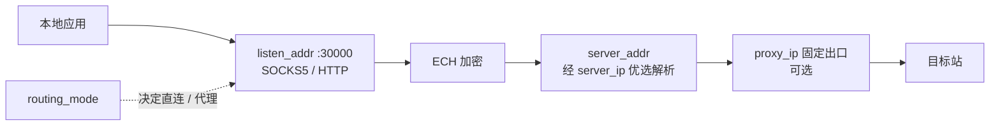

<h1 align="center">ech-wk-main</h1>

<p align="center">ECH Workers 代理客户端 · 开箱即用的 <code>bypass_cn</code> 运行配置包</p>

<p align="center">
  <a href="./LICENSE"></a>
  
  
  
  
  <a href="https://github.com/Dirige/ech-proxy-panel/pkgs/container/ech-proxy-panel"></a>
</p>

---

> **定位**：本包是原 ECH Proxy Panel 项目的**便捷分流策略补充方案**（一套可直接套用的 `bypass_cn` 配置），原项目为主、本包为辅；二进制 / 面板 / 源码均在原项目。
>
> 上游说明（本地只读参考，不在本仓）：`../ech-proxy-panel-trae-agent-XS7r7t/README.md`（参数全集 + 面板）、`../ECHWorkers-windows-amd64/README.txt`（桌面端）。

## 功能特性

| 能力 | 说明 |
|------|------|
| 开箱即用 | 9 字段 `config.json`，监听 / 落地 / 分流 / 面板全覆盖 |
| `bypass_cn` 分流 | 国内直连、国外代理，软路由友好 |
| 优选 + 固定出口 | `server_ip` 优选 IP/域名，`proxy_ip` 固定出口 IP |
| Web 面板 | `:9090` 可视化改配置、看流量 |
| 一键校验 | `scripts/Test-Config.ps1`，改完配置先验再跑 |
| 一键启动 | `docker-compose.yml` + 自定义规则模板 `rules.example.txt` |

## 快速开始

前置：已拿到服务端地址 + 令牌；已准备 `ech-workers` 二进制或 Docker。

```powershell
# 1. 进目录（运行目录：任意，先进到本目录所在位置）
Set-Location -LiteralPath "./ech-wk-main"

# 2. 复制模板改出自己的配置
Copy-Item -LiteralPath "config.example.json" -Destination "config.json"

# 3. 一键校验
.\scripts\Test-Config.ps1

# 4. 启动（运行目录：ech-wk-main）
docker compose up -d
```

<details>
<summary>备选：单条 <code>docker run</code>（不用 compose）</summary>

```bash
docker run -d --name ech-proxy --restart always \
  -p 9090:9090 -p 30000:30000 \
  -v ${PWD}/config.json:/data/config.json \
  ghcr.io/dirige/ech-proxy-panel:latest
```

</details>

<details>
<summary>备选：桌面端 GUI（Windows）</summary>

把 `config.json` 放到 `ECHWorkersGUI.exe` 同目录，双击启动，浏览器 / 系统代理指向 `127.0.0.1:30000` 验证。

</details>

跑起来后：

- 面板 → 浏览器打开 `http://你的IP:9090`
- 代理 → `127.0.0.1:30000`（SOCKS5 / HTTP）

## 配置速查

完整说明见 [`docs/getting-started.md`](./docs/getting-started.md)。

| 字段 | 作用 | 示例 |
|------|------|------|
| `listen_addr` | 本地监听 | `0.0.0.0:30000` |
| `server_addr` | 服务端地址（必填，带 `:443`） | `你的服务地址:443` |
| `server_ip` | 优选 IP / 域名，可空 | `172.64.229.240` |
| `token` | 认证令牌 | `your-token` |
| `dns_server` | DoH 服务器 | `dns.alidns.com/dns-query` |
| `ech_domain` | ECH 域名 | `cloudflare-ech.com` |
| `routing_mode` | 分流模式（见下表） | `bypass_cn` |
| `web_addr` | 面板监听 | `:9090` |
| `proxy_ip` | 固定出口，可空 | `101.79.165.113:443` |

### 分流模式

| 模式 | 说明 |
|------|------|
| `global` | 全局代理（上游面板默认） |
| `bypass_cn` | 跳过中国大陆（**本包默认**：国内直连、国外代理） |
| `none` | 不代理，直连 |
| `custom` | 自定义规则（需 `-rules` 文件，见 `rules.example.txt`） |

### 数据流



## 目录结构

```text
ech-wk-main/
├── config.json            # 现役配置（可正常提交，token 系公开信息）
├── config.example.json    # 配置模板
├── docker-compose.yml     # 一键启动
├── rules.example.txt      # custom 分流规则模板
├── Dockerfile             # 镜像构建（CI 自动推 ghcr.io）
├── .github/workflows/     # CI：push main 自动构建
├── scripts/
│   └── Test-Config.ps1    # 一键校验
├── src/                   # Go 源码（供 Docker 构建）
├── docs/                  # 详细文档
├── AGENTS.md              # 给 AI 看的仓库约定
├── LICENSE                # MIT
└── README.md              # 本文件
```

## 文档导航

| 文档 | 内容 |
|------|------|
| [`docs/index.md`](./docs/index.md) | 文档入口 |
| [`docs/getting-started.md`](./docs/getting-started.md) | 9 字段详解 + 三种启动方式 |
| [`docs/faq-troubleshooting.md`](./docs/faq-troubleshooting.md) | 连不上 / 端口占用 / 分流不生效排错 |
| [`AGENTS.md`](./AGENTS.md) | AI 协作约定（行为守则、提交规范） |

## 说明与安全提示

- 本包 `token` / `server_addr` 系公开群组的公开信息，**无需保密**：`config.json` 可正常提交、截图分享。
- `web_addr` 默认 `:9090` 监听全接口且面板无登录鉴权：**公网机必须收敛到 `127.0.0.1:9090` 或加反代鉴权 + 防火墙收紧**；仅内网软路由场景保留全接口。

## 相关项目

- 原项目：[byJoey/ech-wk](https://github.com/byJoey/ech-wk)
- 致谢：中国 IP 列表 [mayaxcn/china-ip-list](https://github.com/mayaxcn/china-ip-list)

## Docker 构建

本仓库含 `Dockerfile`，推送到 `main` 后 GitHub Actions 自动构建并推送镜像到 `ghcr.io`。

```bash
# 拉取最新镜像
docker pull ghcr.io/dirige/ech-proxy-panel:latest
```

<details>
<summary>本地构建（不用 CI）</summary>

```bash
docker build -t ech-proxy-local .
docker run -d --name ech-proxy --restart always -p 9090:9090 -p 30000:30000 -v ./config.json:/data/config.json ech-proxy-local
```

</details>

## 许可证

本目录见 [`LICENSE`](./LICENSE)（MIT）；上游代码以其仓库 LICENSE 为准。
